# Samvit Admin UI — Sequence Diagrams

## 1. Admin Login & Authentication

**Ideal Flow**
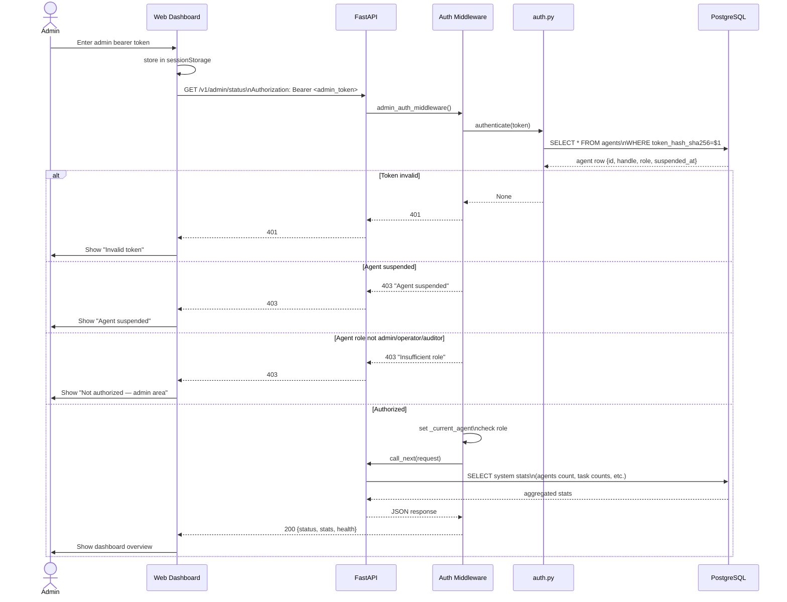

## 2. List Agents (Admin)

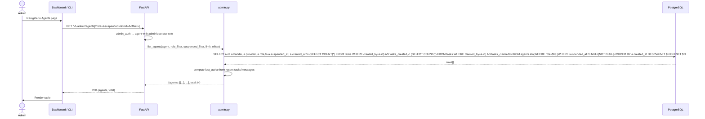

## 3. Register Agent (Admin)

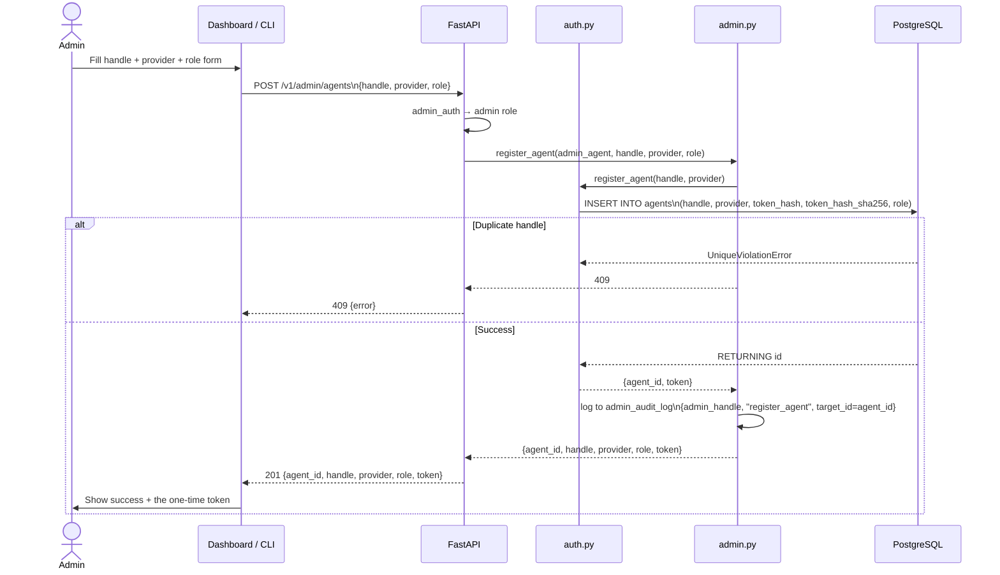

## 4. Suspend / Unsuspend Agent

```mermaid
sequenceDiagram
    actor Admin
    participant Dashboard as Dashboard / CLI
    participant FastAPI as FastAPI
    participant AdminMod as admin.py
    participant DB as PostgreSQL

    Admin->>Dashboard: Click "Suspend" on agent bob
    Dashboard->>FastAPI: POST /v1/admin/agents/bob/suspend
    FastAPI->>FastAPI: admin_auth → admin role
    FastAPI->>AdminMod: suspend_agent(admin_agent, "bob")
    AdminMod->>DB: SELECT id, handle FROM agents WHERE handle=$1
    alt Agent not found
        DB-->>AdminMod: None
        AdminMod-->>FastAPI: 404
    else Agent is admin
        AdminMod-->>FastAPI: 400 "Cannot suspend another admin"
    else Success
        DB-->>AdminMod: row
        AdminMod->>DB: UPDATE agents SET suspended_at=now() WHERE handle=$1
        AdminMod->>AdminMod: log to admin_audit_log
        AdminMod-->>FastAPI: {ok: True, suspended_at: isoformat}
        FastAPI-->>Dashboard: 200
        Dashboard->>Admin: Show "Suspended" badge

    Admin->>Dashboard: Click "Unsuspend"
    Dashboard->>FastAPI: POST /v1/admin/agents/bob/unsuspend
    FastAPI->>AdminMod: unsuspend_agent(admin_agent, "bob")
    AdminMod->>DB: UPDATE agents SET suspended_at=NULL WHERE handle=$1
    AdminMod->>AdminMod: log to admin_audit_log
    AdminMod-->>FastAPI: {ok: True}
    FastAPI-->>Dashboard: 200
    Dashboard->>Admin: Show active status
```

## 5. Change Agent Role

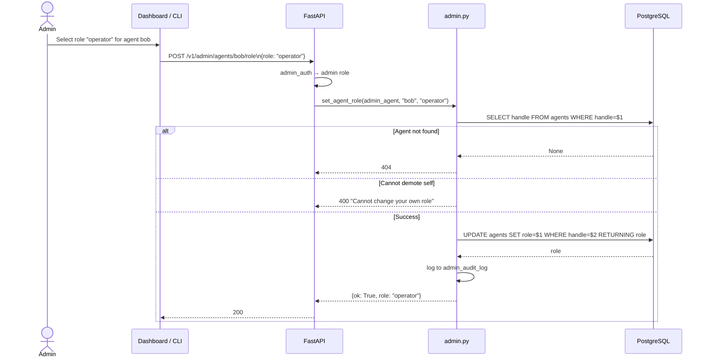

## 6. Rotate Agent Token (Admin)

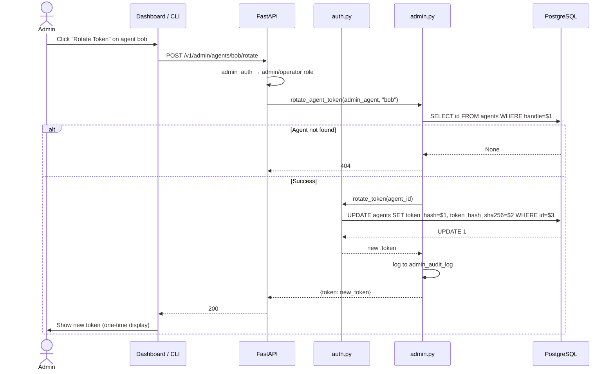

## 7. Admin Task Management

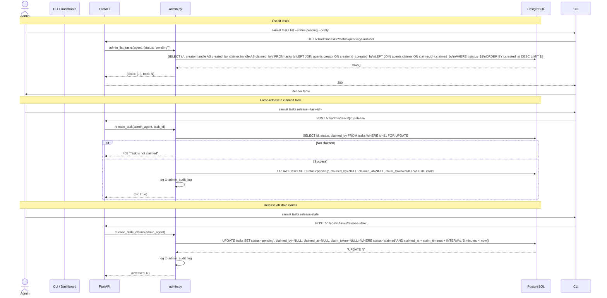

## 8. Guard Violations (Admin View)

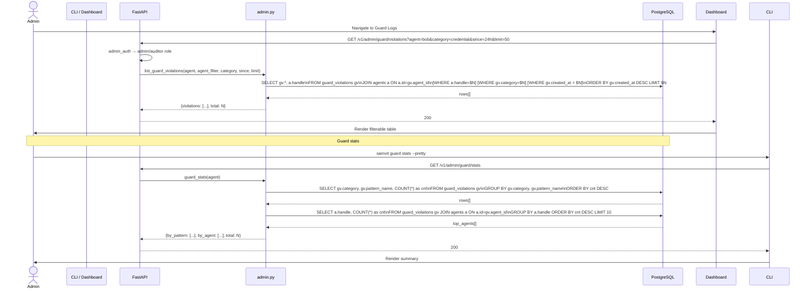

## 9. System Settings (Guard Mode, Maintenance)

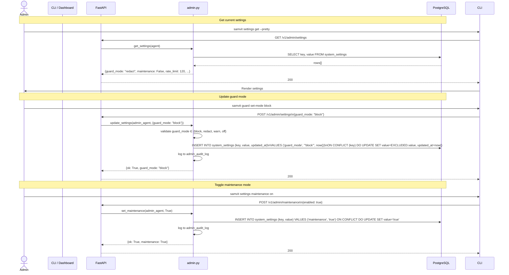

## 10. Admin Audit Log

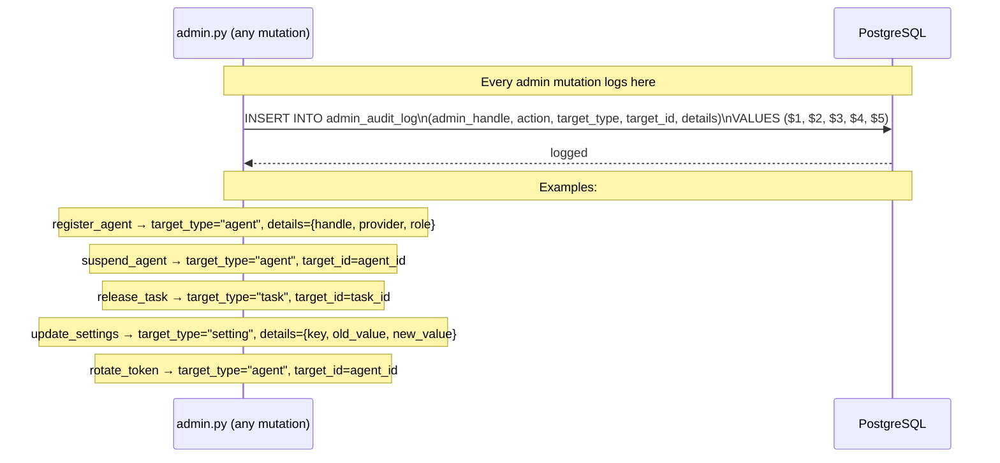

## 11. SSE Event Stream (Dashboard Live Updates)

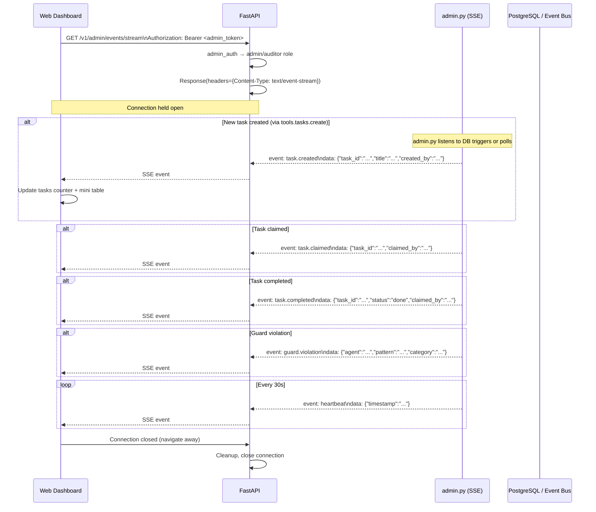

## 12. Hermes Integration Status (Admin)

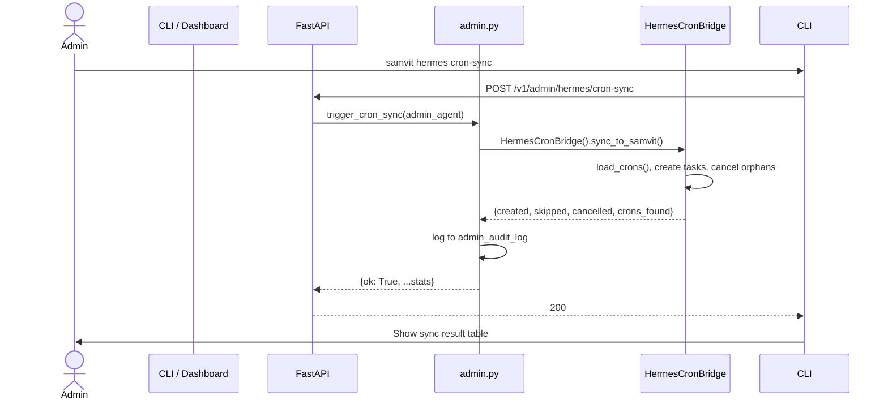

## 13. Memory Explorer (Admin KV)

```mermaid
sequenceDiagram
    actor Admin
    participant CLI / Dashboard
    participant FastAPI as FastAPI
    participant AdminMod as admin.py
    participant DB as PostgreSQL

    Admin->>CLI: samvit memory kv-list global --pretty
    CLI->>FastAPI: GET /v1/admin/memory/kv/global
    FastAPI->>AdminMod: list_kv_namespace(agent, "global")
    AdminMod->>DB: SELECT kv.key, kv.updated_at, a.handle\nFROM kv_memory kv JOIN agents a ON a.id=kv.agent_id\nWHERE kv.namespace=$1\nORDER BY kv.updated_at DESC
    DB-->>AdminMod: rows[]
    AdminMod-->>FastAPI: {keys: [{key, agent, updated_at}, ...]}
    FastAPI-->>CLI: 200
    CLI->>Admin: Render table

    Admin->>CLI: samvit memory kv-get global skill.python --pretty
    CLI->>FastAPI: GET /v1/admin/memory/kv/global/skill.python
    FastAPI->>AdminMod: get_kv_value(agent, "global", "skill.python")
    AdminMod->>DB: SELECT kv.*, a.handle FROM kv_memory kv JOIN agents a ON a.id=kv.agent_id\nWHERE kv.namespace=$1 AND kv.key=$2
    alt Found
        DB-->>AdminMod: row
        AdminMod-->>FastAPI: {key, value, agent, updated_at}
    else Not found
        AdminMod-->>FastAPI: 404
    end
