# Samvit Sequence Diagrams & Gap Analysis

## 1. Agent Registration

**Ideal Flow**
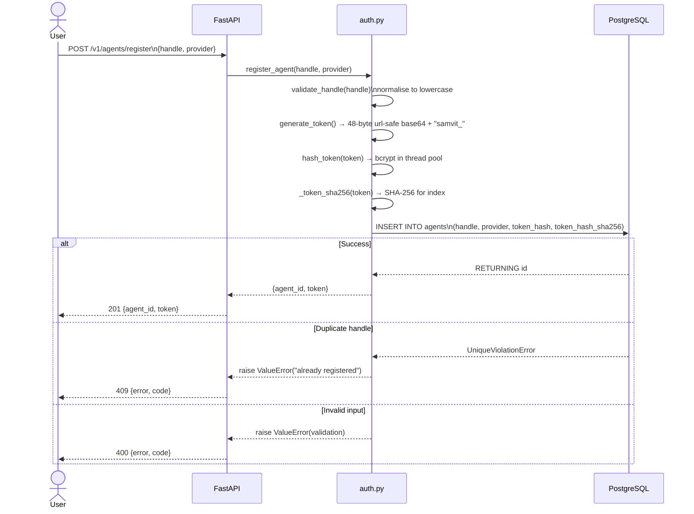
```mermaid
sequenceDiagram
    actor User
    participant FastAPI as FastAPI
    participant Auth as auth.py
    participant DB as PostgreSQL

    User->>FastAPI: POST /v1/agents/register\n{handle, provider}
    FastAPI->>Auth: register_agent(handle, provider)
    Auth->>Auth: validate_handle(handle)\nnormalise to lowercase
    Auth->>Auth: generate_token() → 48-byte url-safe base64 + "samvit_"
    Auth->>Auth: hash_token(token) → bcrypt in thread pool
    Auth->>Auth: _token_sha256(token) → SHA-256 for index
    Auth->>DB: INSERT INTO agents\n(handle, provider, token_hash, token_hash_sha256)
    alt Success
        DB-->>Auth: RETURNING id
        Auth-->>FastAPI: {agent_id, token}
        FastAPI-->>User: 201 {agent_id, token}
    else Duplicate handle
        DB-->>Auth: UniqueViolationError
        Auth-->>FastAPI: raise ValueError("already registered")
        FastAPI-->>User: 409 {error, code}
    else Invalid input
        Auth-->>FastAPI: raise ValueError(validation)
        FastAPI-->>User: 400 {error, code}
    end
```

**Actual Flow** (matches ideal exactly — no deviation)

---

## 2. Bearer Token Authentication (Middleware)

**Ideal Flow**
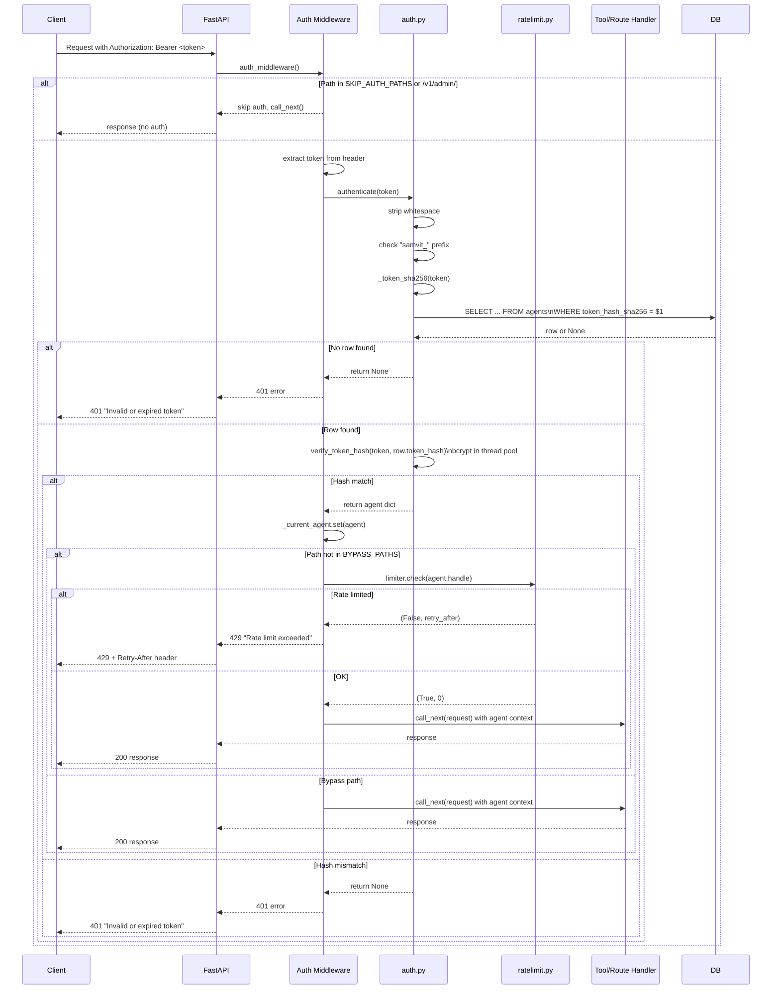
```mermaid
sequenceDiagram
    participant Client
    participant FastAPI as FastAPI
    participant MW as Auth Middleware
    participant Auth as auth.py
    participant RateLimit as ratelimit.py
    participant Handler as Tool/Route Handler

    Client->>FastAPI: Request with Authorization: Bearer <token>
    FastAPI->>MW: auth_middleware()
    alt Path in SKIP_AUTH_PATHS or /v1/admin/
        MW-->>FastAPI: skip auth, call_next()
        FastAPI-->>Client: response (no auth)
    else
        MW->>MW: extract token from header
        MW->>Auth: authenticate(token)
        Auth->>Auth: strip whitespace
        Auth->>Auth: check "samvit_" prefix
        Auth->>Auth: _token_sha256(token)
        Auth->>DB: SELECT ... FROM agents\nWHERE token_hash_sha256 = $1
        DB-->>Auth: row or None
        alt No row found
            Auth-->>MW: return None
            MW-->>FastAPI: 401 error
            FastAPI-->>Client: 401 "Invalid or expired token"
        else Row found
            Auth->>Auth: verify_token_hash(token, row.token_hash)\nbcrypt in thread pool
            alt Hash match
                Auth-->>MW: return agent dict
                MW->>MW: _current_agent.set(agent)
                alt Path not in BYPASS_PATHS
                    MW->>RateLimit: limiter.check(agent.handle)
                    alt Rate limited
                        RateLimit-->>MW: (False, retry_after)
                        MW-->>FastAPI: 429 "Rate limit exceeded"
                        FastAPI-->>Client: 429 + Retry-After header
                    else OK
                        RateLimit-->>MW: (True, 0)
                        MW->>Handler: call_next(request) with agent context
                        Handler-->>FastAPI: response
                        FastAPI-->>Client: 200 response
                    end
                else Bypass path
                    MW->>Handler: call_next(request) with agent context
                    Handler-->>FastAPI: response
                    FastAPI-->>Client: 200 response
                end
            else Hash mismatch
                Auth-->>MW: return None
                MW-->>FastAPI: 401 error
                FastAPI-->>Client: 401 "Invalid or expired token"
            end
        end
    end
```

**Actual Flow** (matches ideal — no deviation)

---

## 3. Token Rotation

**Ideal Flow**
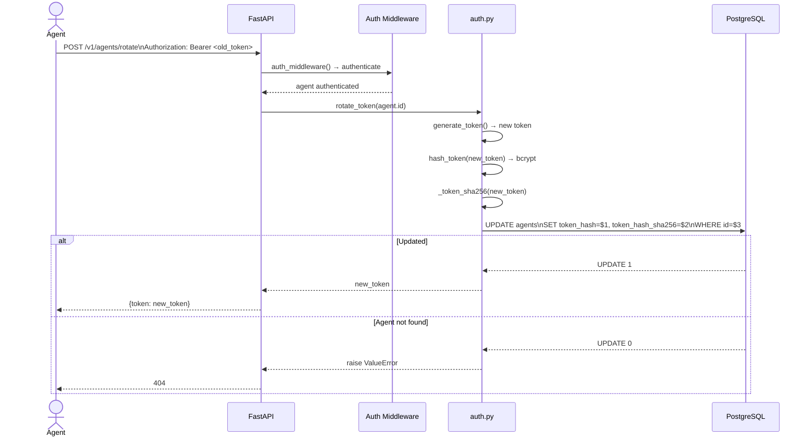
```mermaid
sequenceDiagram
    actor Agent
    participant FastAPI as FastAPI
    participant MW as Auth Middleware
    participant Auth as auth.py
    participant DB as PostgreSQL

    Agent->>FastAPI: POST /v1/agents/rotate\nAuthorization: Bearer <old_token>
    FastAPI->>MW: auth_middleware() → authenticate
    MW-->>FastAPI: agent authenticated
    FastAPI->>Auth: rotate_token(agent.id)
    Auth->>Auth: generate_token() → new token
    Auth->>Auth: hash_token(new_token) → bcrypt
    Auth->>Auth: _token_sha256(new_token)
    Auth->>DB: UPDATE agents\nSET token_hash=$1, token_hash_sha256=$2\nWHERE id=$3
    alt Updated
        DB-->>Auth: UPDATE 1
        Auth-->>FastAPI: new_token
        FastAPI-->>Agent: {token: new_token}
    else Agent not found
        DB-->>Auth: UPDATE 0
        Auth-->>FastAPI: raise ValueError
        FastAPI-->>Agent: 404
    end
```

**Actual Flow** (matches ideal — no deviation; note: old token is still valid since no explicit invalidation beyond overwrite)

---

## 4. Admin Token Reset (Escape Hatch)

**Ideal Flow**
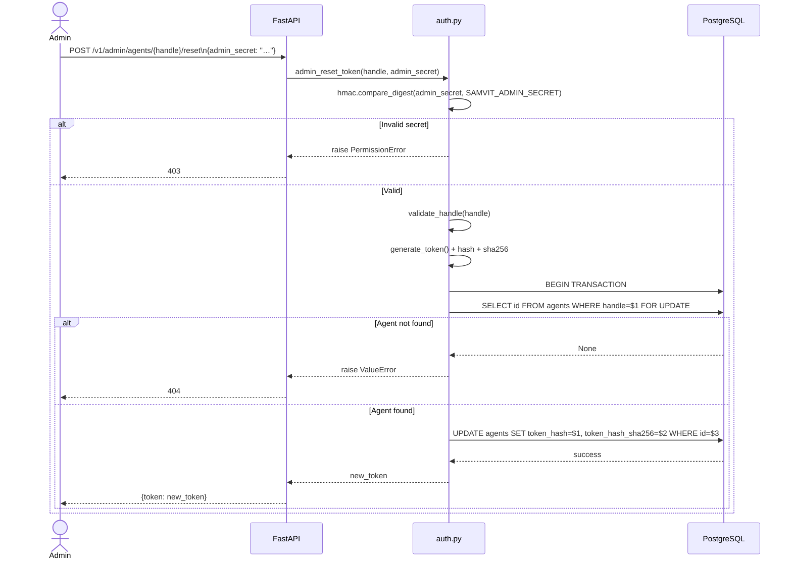
```mermaid
sequenceDiagram
    actor Admin
    participant FastAPI as FastAPI
    participant Auth as auth.py
    participant DB as PostgreSQL

    Admin->>FastAPI: POST /v1/admin/agents/{handle}/reset\n{admin_secret: "…"}
    FastAPI->>Auth: admin_reset_token(handle, admin_secret)
    Auth->>Auth: hmac.compare_digest(admin_secret, SAMVIT_ADMIN_SECRET)
    alt Invalid secret
        Auth-->>FastAPI: raise PermissionError
        FastAPI-->>Admin: 403
    else Valid
        Auth->>Auth: validate_handle(handle)
        Auth->>Auth: generate_token() + hash + sha256
        Auth->>DB: BEGIN TRANSACTION
        Auth->>DB: SELECT id FROM agents WHERE handle=$1 FOR UPDATE
        alt Agent not found
            DB-->>Auth: None
            Auth-->>FastAPI: raise ValueError
            FastAPI-->>Admin: 404
        else Agent found
            Auth->>DB: UPDATE agents SET token_hash=$1, token_hash_sha256=$2 WHERE id=$3
            DB-->>Auth: success
            Auth-->>FastAPI: new_token
            FastAPI-->>Admin: {token: new_token}
        end
    end
```

**Actual Flow** (matches ideal — no deviation)

---

## 5. MCP: remember (Store Memory)

**Ideal Flow**
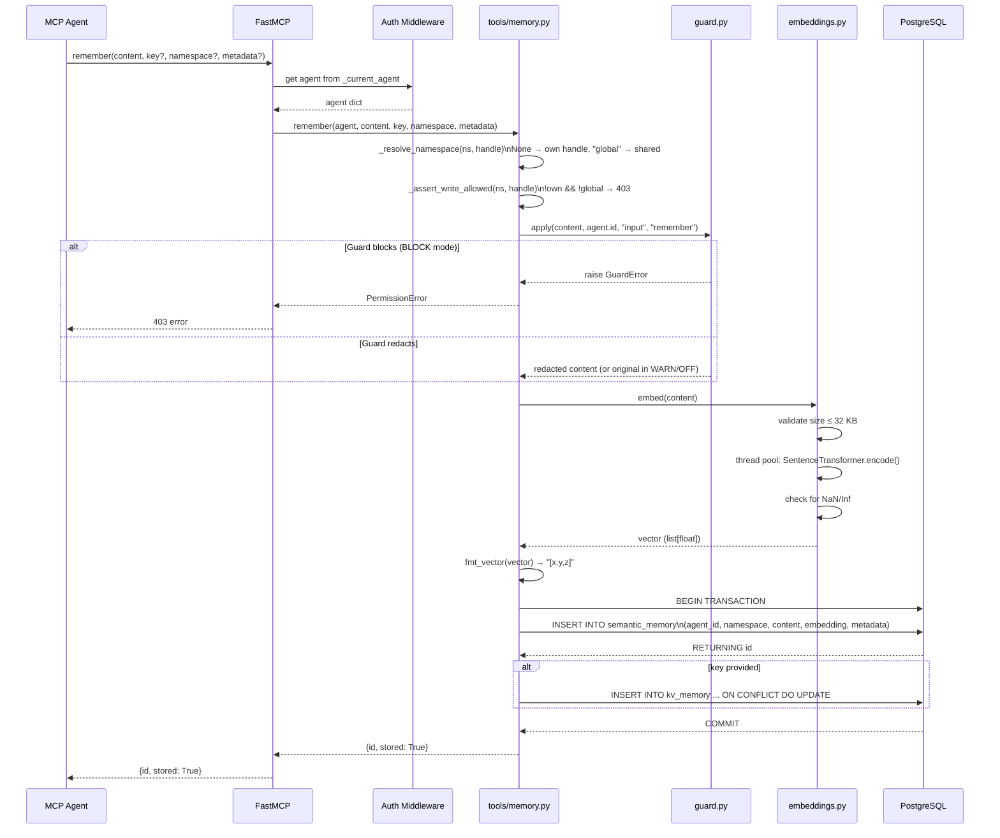
```mermaid
sequenceDiagram
    participant Agent as MCP Agent
    participant MCP as FastMCP
    participant MW as Auth Middleware
    participant Mem as tools/memory.py
    participant Guard as guard.py
    participant Embed as embeddings.py
    participant DB as PostgreSQL

    Agent->>MCP: remember(content, key?, namespace?, metadata?)
    MCP->>MW: get agent from _current_agent
    MW-->>MCP: agent dict
    MCP->>Mem: remember(agent, content, key, namespace, metadata)
    Mem->>Mem: _resolve_namespace(ns, handle)\nNone → own handle, "global" → shared
    Mem->>Mem: _assert_write_allowed(ns, handle)\n!own && !global → 403
    Mem->>Guard: apply(content, agent.id, "input", "remember")
    alt Guard blocks (BLOCK mode)
        Guard-->>Mem: raise GuardError
        Mem-->>MCP: PermissionError
        MCP-->>Agent: 403 error
    else Guard redacts
        Guard-->>Mem: redacted content (or original in WARN/OFF)
    end
    Mem->>Embed: embed(content)
    Embed->>Embed: validate size ≤ 32 KB
    Embed->>Embed: thread pool: SentenceTransformer.encode()
    Embed->>Embed: check for NaN/Inf
    Embed-->>Mem: vector (list[float])
    Mem->>Mem: fmt_vector(vector) → "[x,y,z]"
    Mem->>DB: BEGIN TRANSACTION
    Mem->>DB: INSERT INTO semantic_memory\n(agent_id, namespace, content, embedding, metadata)
    DB-->>Mem: RETURNING id
    alt key provided
        Mem->>DB: INSERT INTO kv_memory ... ON CONFLICT DO UPDATE
    end
    DB-->>Mem: COMMIT
    Mem-->>MCP: {id, stored: True}
    MCP-->>Agent: {id, stored: True}
```

**Actual Flow** Deviation notes:
- Before the guard check on line 51, `content` gets reassigned to potentially redacted text — but the original content is what the agent "remembers" after redaction, which is correct behavior
- There is no transactional rollback if embedding fails between line 54 and line 56 — the vector variable is computed in-memory before any DB call, so this is safe
- **Gap**: `_assert_write_allowed` is called before `guard.apply`, so a BLOCKED input still reveals namespace permissions — minor information leak

---

## 6. MCP: recall (Retrieve Memories)

**Ideal Flow**
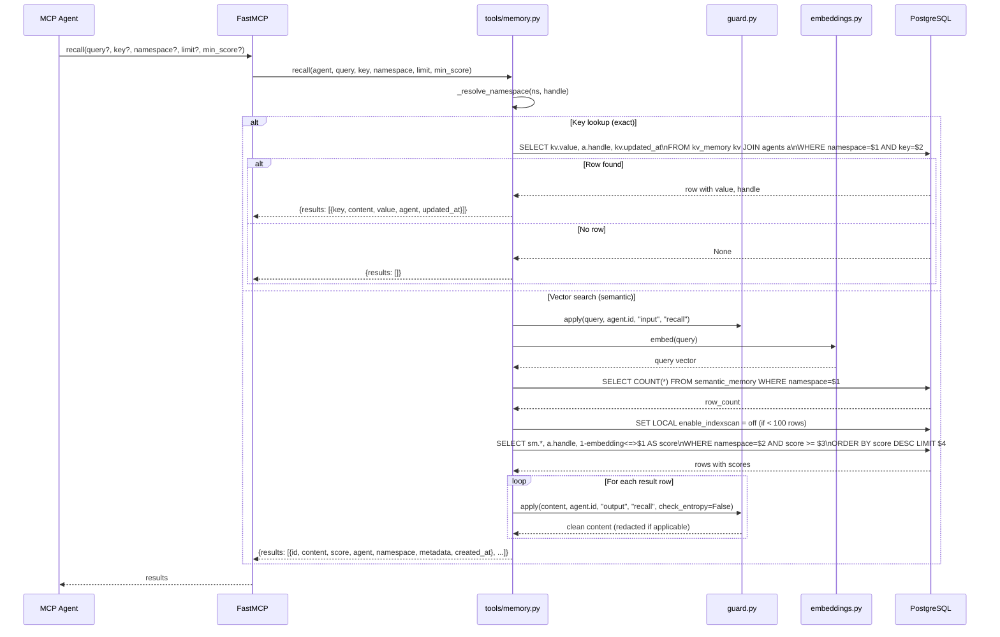
```mermaid
sequenceDiagram
    participant Agent as MCP Agent
    participant MCP as FastMCP
    participant Mem as tools/memory.py
    participant Guard as guard.py
    participant Embed as embeddings.py
    participant DB as PostgreSQL

    Agent->>MCP: recall(query?, key?, namespace?, limit?, min_score?)
    MCP->>Mem: recall(agent, query, key, namespace, limit, min_score)
    Mem->>Mem: _resolve_namespace(ns, handle)
    
    alt Key lookup (exact)
        Mem->>DB: SELECT kv.value, a.handle, kv.updated_at\nFROM kv_memory kv JOIN agents a\nWHERE namespace=$1 AND key=$2
        alt Row found
            DB-->>Mem: row with value, handle
            Mem-->>MCP: {results: [{key, content, value, agent, updated_at}]}
        else No row
            DB-->>Mem: None
            Mem-->>MCP: {results: []}
        end
    else Vector search (semantic)
        Mem->>Guard: apply(query, agent.id, "input", "recall")
        Mem->>Embed: embed(query)
        Embed-->>Mem: query vector
        Mem->>DB: SELECT COUNT(*) FROM semantic_memory WHERE namespace=$1
        DB-->>Mem: row_count
        Mem->>DB: SET LOCAL enable_indexscan = off (if < 100 rows)
        Mem->>DB: SELECT sm.*, a.handle, 1-embedding<=>$1 AS score\nWHERE namespace=$2 AND score >= $3\nORDER BY score DESC LIMIT $4
        DB-->>Mem: rows with scores
        loop For each result row
            Mem->>Guard: apply(content, agent.id, "output", "recall", check_entropy=False)
            Guard-->>Mem: clean content (redacted if applicable)
        end
        Mem-->>MCP: {results: [{id, content, score, agent, namespace, metadata, created_at}, ...]}
    end
    
    MCP-->>Agent: results
```

**Actual Flow** Deviation notes:
- **Gap**: The KV recall path does NOT apply the Ethical Guard to the content returned from kv_memory. The `_kv_recall` function (line 131-156) returns the stored value as-is without calling `guard.apply()` on the output. This means KV memories bypass the guard on read, unlike vector memories which are guarded in `_vector_recall`.
- **Gap**: The `recall` MCP tool strips the `agent` from results (it's the handle in both KV and vector paths). In KV path, key is spelled "key" in results; in vector path there's no key. Both are minor inconsistencies.

---

## 7. MCP: forget (Delete Memory)

**Ideal Flow**
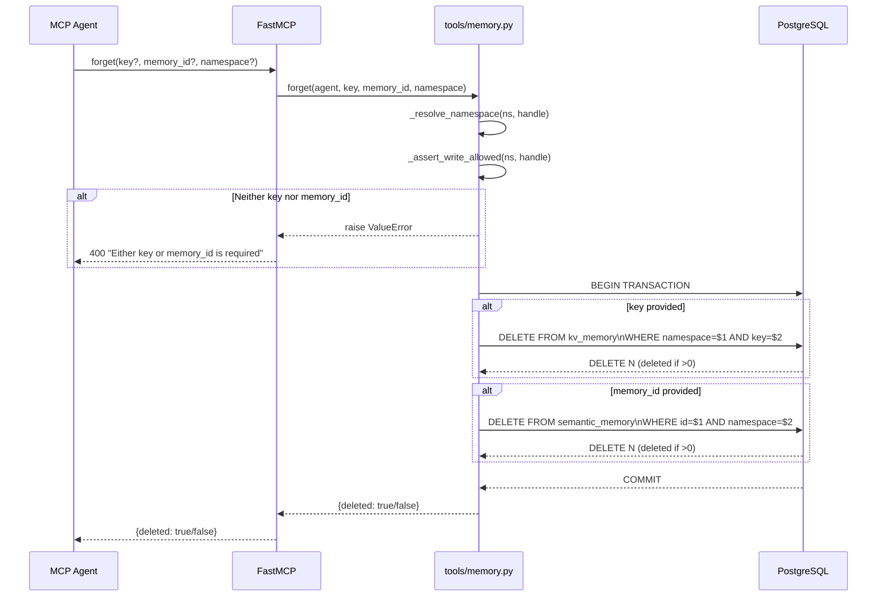
```mermaid
sequenceDiagram
    participant Agent as MCP Agent
    participant MCP as FastMCP
    participant Mem as tools/memory.py
    participant DB as PostgreSQL

    Agent->>MCP: forget(key?, memory_id?, namespace?)
    MCP->>Mem: forget(agent, key, memory_id, namespace)
    Mem->>Mem: _resolve_namespace(ns, handle)
    Mem->>Mem: _assert_write_allowed(ns, handle)
    
    alt Neither key nor memory_id
        Mem-->>MCP: raise ValueError
        MCP-->>Agent: 400 "Either key or memory_id is required"
    end
    
    Mem->>DB: BEGIN TRANSACTION
    alt key provided
        Mem->>DB: DELETE FROM kv_memory\nWHERE namespace=$1 AND key=$2
        DB-->>Mem: DELETE N (deleted if >0)
    end
    alt memory_id provided
        Mem->>DB: DELETE FROM semantic_memory\nWHERE id=$1 AND namespace=$2
        DB-->>Mem: DELETE N (deleted if >0)
    end
    DB-->>Mem: COMMIT
    Mem-->>MCP: {deleted: true/false}
    MCP-->>Agent: {deleted: true/false}
```

**Actual Flow** (matches ideal — no deviation)

---

## 8. MCP: create_task

**Ideal Flow**
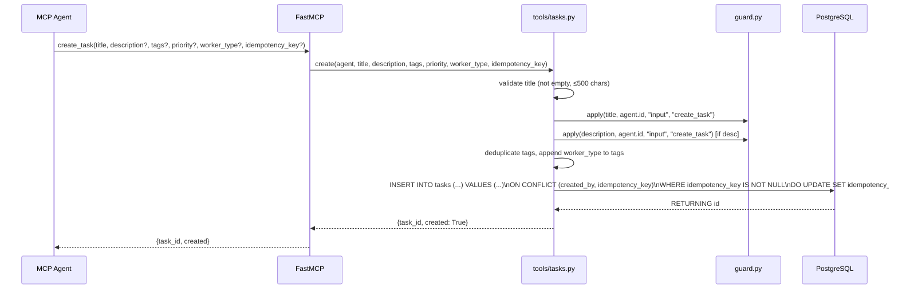
```mermaid
sequenceDiagram
    participant Agent as MCP Agent
    participant MCP as FastMCP
    participant Task as tools/tasks.py
    participant Guard as guard.py
    participant DB as PostgreSQL

    Agent->>MCP: create_task(title, description?, tags?, priority?, worker_type?, idempotency_key?)
    MCP->>Task: create(agent, title, description, tags, priority, worker_type, idempotency_key)
    Task->>Task: validate title (not empty, ≤500 chars)
    Task->>Guard: apply(title, agent.id, "input", "create_task")
    Task->>Guard: apply(description, agent.id, "input", "create_task") [if desc]
    Task->>Task: deduplicate tags, append worker_type to tags
    Task->>DB: INSERT INTO tasks (...) VALUES (...)\nON CONFLICT (created_by, idempotency_key)\nWHERE idempotency_key IS NOT NULL\nDO UPDATE SET idempotency_key=EXCLUDED.idempotency_key
    DB-->>Task: RETURNING id
    Task-->>MCP: {task_id, created: True}
    MCP-->>Agent: {task_id, created}
```

**Actual Flow** (matches ideal — no deviation; note the ON CONFLICT DO UPDATE pattern doesn't actually change any meaningful task data — it just re-assigns the idempotency_key to itself, which is a no-op update)

---

## 9. MCP: claim (Claim a Task)

**Ideal Flow**
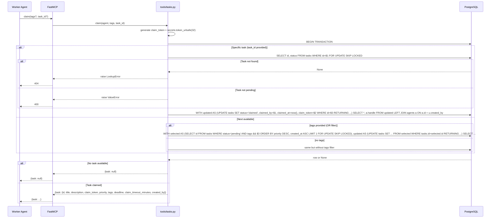
```mermaid
sequenceDiagram
    participant Worker as Worker Agent
    participant MCP as FastMCP
    participant Task as tools/tasks.py
    participant DB as PostgreSQL

    Worker->>MCP: claim(tags?, task_id?)
    MCP->>Task: claim(agent, tags, task_id)
    Task->>Task: generate claim_token = secrets.token_urlsafe(32)
    Task->>DB: BEGIN TRANSACTION
    
    alt Specific task (task_id provided)
        Task->>DB: SELECT id, status FROM tasks WHERE id=$1 FOR UPDATE SKIP LOCKED
        alt Task not found
            DB-->>Task: None
            Task-->>MCP: raise LookupError
            MCP-->>Worker: 404
        else Task not pending
            Task-->>MCP: raise ValueError
            MCP-->>Worker: 400
        end
        Task->>DB: WITH updated AS (UPDATE tasks SET status='claimed', claimed_by=$1, claimed_at=now(), claim_token=$2 WHERE id=$3 RETURNING ...) SELECT *, a.handle FROM updated LEFT JOIN agents a ON a.id = u.created_by
    else Next available
        alt tags provided (OR filter)
            Task->>DB: WITH selected AS (SELECT id FROM tasks WHERE status='pending' AND tags && $3 ORDER BY priority DESC, created_at ASC LIMIT 1 FOR UPDATE SKIP LOCKED), updated AS (UPDATE tasks SET ... FROM selected WHERE tasks.id=selected.id RETURNING ...) SELECT ...
        else no tags
            Task->>DB: same but without tags filter
        end
    end
    
    DB-->>Task: row or None
    alt No task available
        Task-->>MCP: {task: null}
        MCP-->>Worker: {task: null}
    else Task claimed
        Task-->>MCP: {task: {id, title, description, claim_token, priority, tags, deadline, claim_timeout_minutes, created_by}}
        MCP-->>Worker: {task: ...}
    end
```

**Actual Flow** (matches ideal — no deviation; CTE + FOR UPDATE SKIP LOCKED pattern ensures atomicity)

---

## 10. MCP: done (Complete/Fail a Task)

**Ideal Flow**
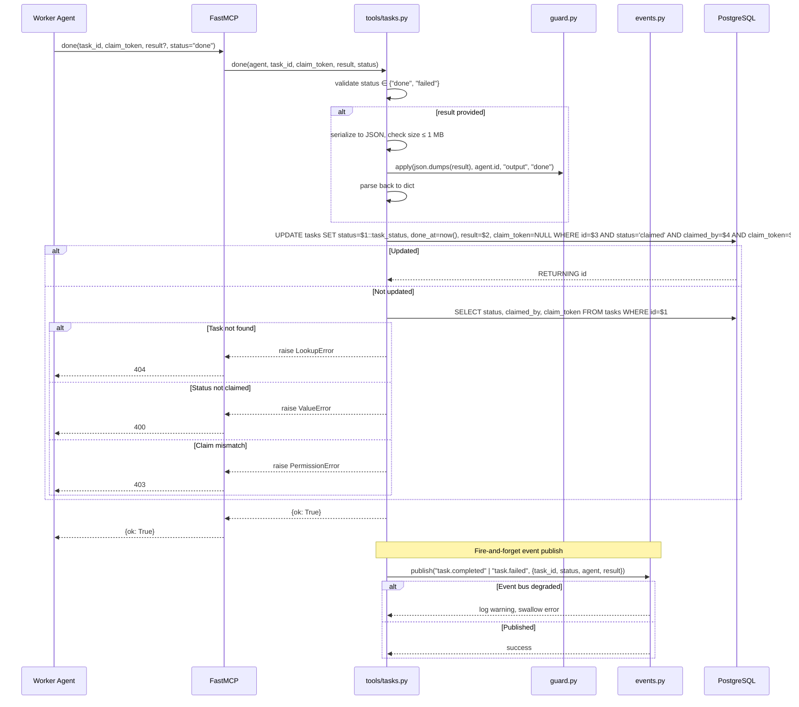
```mermaid
sequenceDiagram
    participant Worker as Worker Agent
    participant MCP as FastMCP
    participant Task as tools/tasks.py
    participant Guard as guard.py
    participant Events as events.py
    participant DB as PostgreSQL

    Worker->>MCP: done(task_id, claim_token, result?, status="done")
    MCP->>Task: done(agent, task_id, claim_token, result, status)
    Task->>Task: validate status ∈ {"done", "failed"}
    
    alt result provided
        Task->>Task: serialize to JSON, check size ≤ 1 MB
        Task->>Guard: apply(json.dumps(result), agent.id, "output", "done")
        Task->>Task: parse back to dict
    end
    
    Task->>DB: UPDATE tasks SET status=$1::task_status, done_at=now(), result=$2, claim_token=NULL WHERE id=$3 AND status='claimed' AND claimed_by=$4 AND claim_token=$5 RETURNING id
    alt Updated
        DB-->>Task: RETURNING id
    else Not updated
        Task->>DB: SELECT status, claimed_by, claim_token FROM tasks WHERE id=$1
        alt Task not found
            Task-->>MCP: raise LookupError
            MCP-->>Worker: 404
        else Status not claimed
            Task-->>MCP: raise ValueError
            MCP-->>Worker: 400
        else Claim mismatch
            Task-->>MCP: raise PermissionError
            MCP-->>Worker: 403
        end
    end
    
    Task-->>MCP: {ok: True}
    MCP-->>Worker: {ok: True}
    
    Note over Task,Events: Fire-and-forget event publish
    Task->>Events: publish("task.completed" | "task.failed", {task_id, status, agent, result})
    alt Event bus degraded
        Events-->>Task: log warning, swallow error
    else Published
        Events-->>Task: success
    end
```

**Actual Flow** Deviation notes:
- **Gap**: The result object is guarded via `guard.apply()` on the JSON string, then JSON-parsed back. This round-trip is potentially lossy — if the guard redacts content from the JSON string, the `result` dict after `json.loads(result_str)` will have redacted values. This is intentional but could silently corrupt structured data.
- **Gap**: The diagnostic query on lines 457-469 races — between the UPDATE and SELECT, another concurrent request could change the task status. This is a minor read-after-write race that could produce misleading error messages.

---

## 11. MCP: renew (Renew Claim Lease)

**Ideal Flow**
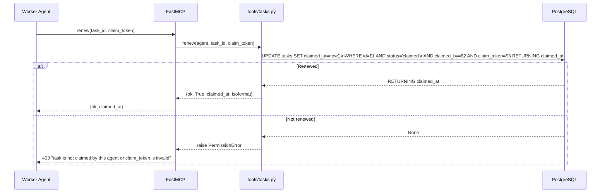
```mermaid
sequenceDiagram
    participant Worker as Worker Agent
    participant MCP as FastMCP
    participant Task as tools/tasks.py
    participant DB as PostgreSQL

    Worker->>MCP: renew(task_id, claim_token)
    MCP->>Task: renew(agent, task_id, claim_token)
    Task->>DB: UPDATE tasks SET claimed_at=now()\nWHERE id=$1 AND status='claimed'\nAND claimed_by=$2 AND claim_token=$3 RETURNING claimed_at
    alt Renewed
        DB-->>Task: RETURNING claimed_at
        Task-->>MCP: {ok: True, claimed_at: isoformat}
        MCP-->>Worker: {ok, claimed_at}
    else Not renewed
        DB-->>Task: None
        Task-->>MCP: raise PermissionError
        MCP-->>Worker: 403 "task is not claimed by this agent or claim_token is invalid"
    end
```

**Actual Flow** (matches ideal — no deviation)

---

## 12. MCP: cancel_task

**Ideal Flow**
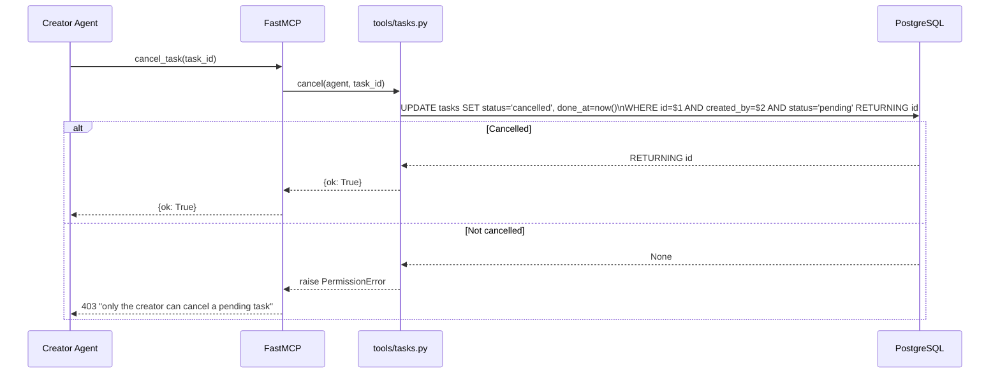
```mermaid
sequenceDiagram
    participant Creator as Creator Agent
    participant MCP as FastMCP
    participant Task as tools/tasks.py
    participant DB as PostgreSQL

    Creator->>MCP: cancel_task(task_id)
    MCP->>Task: cancel(agent, task_id)
    Task->>DB: UPDATE tasks SET status='cancelled', done_at=now()\nWHERE id=$1 AND created_by=$2 AND status='pending' RETURNING id
    alt Cancelled
        DB-->>Task: RETURNING id
        Task-->>MCP: {ok: True}
        MCP-->>Creator: {ok: True}
    else Not cancelled
        DB-->>Task: None
        Task-->>MCP: raise PermissionError
        MCP-->>Creator: 403 "only the creator can cancel a pending task"
    end
```

**Actual Flow** (matches ideal — no deviation)

---

## 13. MCP: update_task

**Ideal Flow**
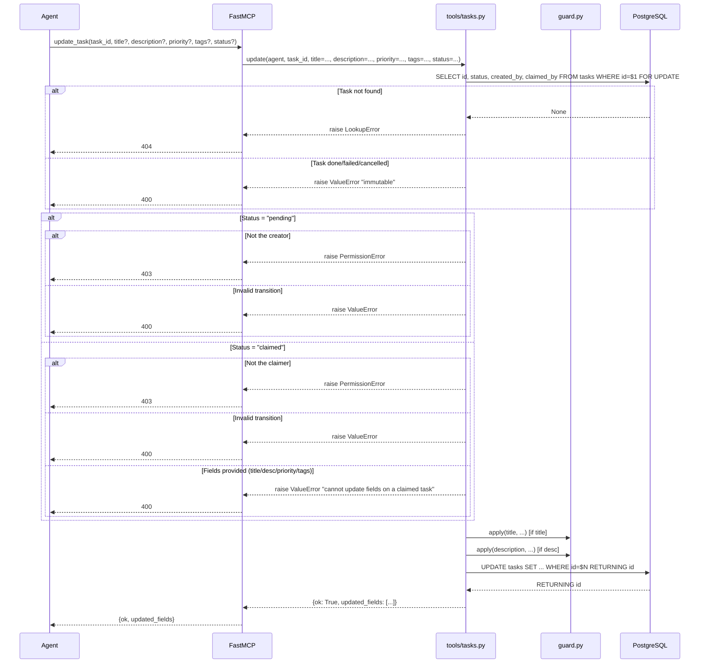
```mermaid
sequenceDiagram
    participant Agent
    participant MCP as FastMCP
    participant Task as tools/tasks.py
    participant Guard as guard.py
    participant DB as PostgreSQL

    Agent->>MCP: update_task(task_id, title?, description?, priority?, tags?, status?)
    MCP->>Task: update(agent, task_id, title=..., description=..., priority=..., tags=..., status=...)
    Task->>DB: SELECT id, status, created_by, claimed_by FROM tasks WHERE id=$1 FOR UPDATE
    
    alt Task not found
        DB-->>Task: None
        Task-->>MCP: raise LookupError
        MCP-->>Agent: 404
    else Task done/failed/cancelled
        Task-->>MCP: raise ValueError "immutable"
        MCP-->>Agent: 400
    end
    
    alt Status = "pending"
        alt Not the creator
            Task-->>MCP: raise PermissionError
            MCP-->>Agent: 403
        else Invalid transition
            Task-->>MCP: raise ValueError
            MCP-->>Agent: 400
        end
    else Status = "claimed"
        alt Not the claimer
            Task-->>MCP: raise PermissionError
            MCP-->>Agent: 403
        else Invalid transition
            Task-->>MCP: raise ValueError
            MCP-->>Agent: 400
        else Fields provided (title/desc/priority/tags)
            Task-->>MCP: raise ValueError "cannot update fields on a claimed task"
            MCP-->>Agent: 400
        end
    end
    
    Task->>Guard: apply(title, ...) [if title]
    Task->>Guard: apply(description, ...) [if desc]
    Task->>DB: UPDATE tasks SET ... WHERE id=$N RETURNING id
    DB-->>Task: RETURNING id
    Task-->>MCP: {ok: True, updated_fields: [...]}
    MCP-->>Agent: {ok, updated_fields}
```

**Actual Flow** (matches ideal — no deviation)

---

## 14. MCP: say (Send Message)

**Ideal Flow**
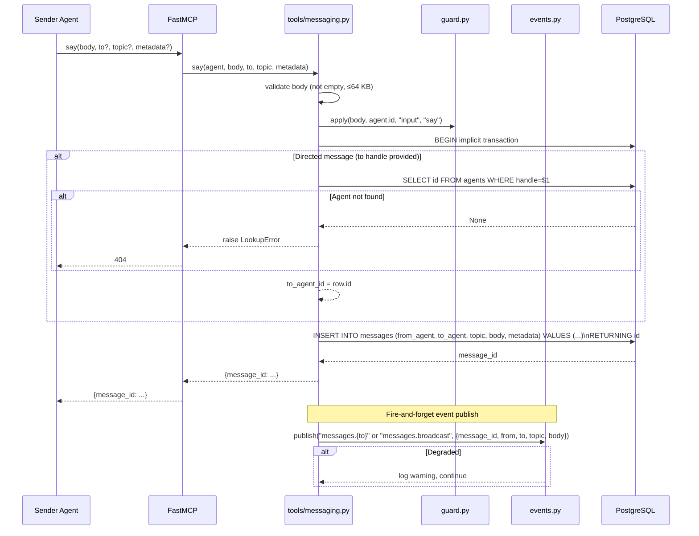
```mermaid
sequenceDiagram
    participant Sender as Sender Agent
    participant MCP as FastMCP
    participant Msg as tools/messaging.py
    participant Guard as guard.py
    participant Events as events.py
    participant DB as PostgreSQL

    Sender->>MCP: say(body, to?, topic?, metadata?)
    MCP->>Msg: say(agent, body, to, topic, metadata)
    Msg->>Msg: validate body (not empty, ≤64 KB)
    Msg->>Guard: apply(body, agent.id, "input", "say")
    
    Msg->>DB: BEGIN implicit transaction
    alt Directed message (to handle provided)
        Msg->>DB: SELECT id FROM agents WHERE handle=$1
        alt Agent not found
            DB-->>Msg: None
            Msg-->>MCP: raise LookupError
            MCP-->>Sender: 404
        end
        Msg-->>Msg: to_agent_id = row.id
    end
    
    Msg->>DB: INSERT INTO messages (from_agent, to_agent, topic, body, metadata) VALUES (...)\nRETURNING id
    DB-->>Msg: message_id
    Msg-->>MCP: {message_id: ...}
    MCP-->>Sender: {message_id: ...}
    
    Note over Msg,Events: Fire-and-forget event publish
    Msg->>Events: publish("messages.{to}" or "messages.broadcast", {message_id, from, to, topic, body})
    alt Degraded
        Events-->>Msg: log warning, continue
    end
```

**Actual Flow** (matches ideal — no deviation)

---

## 15. MCP: read (Read Messages)

**Ideal Flow**
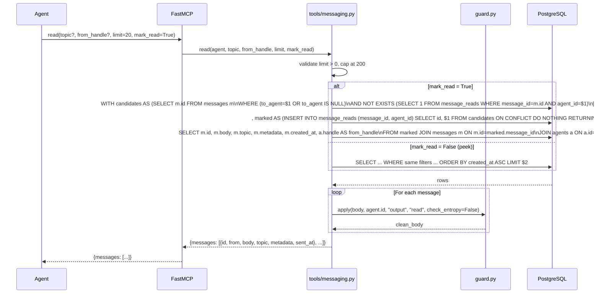
```mermaid
sequenceDiagram
    participant Agent
    participant MCP as FastMCP
    participant Msg as tools/messaging.py
    participant Guard as guard.py
    participant DB as PostgreSQL

    Agent->>MCP: read(topic?, from_handle?, limit=20, mark_read=True)
    MCP->>Msg: read(agent, topic, from_handle, limit, mark_read)
    Msg->>Msg: validate limit > 0, cap at 200
    
    alt mark_read = True
        Msg->>DB: WITH candidates AS (SELECT m.id FROM messages m\nWHERE (to_agent=$1 OR to_agent IS NULL)\nAND NOT EXISTS (SELECT 1 FROM message_reads WHERE message_id=m.id AND agent_id=$1)\n[AND topic=$N] [AND from_handle filter]\nORDER BY created_at ASC LIMIT $2)
        Msg->>DB: , marked AS (INSERT INTO message_reads (message_id, agent_id) SELECT id, $1 FROM candidates ON CONFLICT DO NOTHING RETURNING message_id)
        Msg->>DB: SELECT m.id, m.body, m.topic, m.metadata, m.created_at, a.handle AS from_handle\nFROM marked JOIN messages m ON m.id=marked.message_id\nJOIN agents a ON a.id=m.from_agent\nORDER BY m.created_at ASC
    else mark_read = False (peek)
        Msg->>DB: SELECT ... WHERE same filters ... ORDER BY created_at ASC LIMIT $2
    end
    
    DB-->>Msg: rows
    loop For each message
        Msg->>Guard: apply(body, agent.id, "output", "read", check_entropy=False)
        Guard-->>Msg: clean_body
    end
    Msg-->>MCP: {messages: [{id, from, body, topic, metadata, sent_at}, ...]}
    MCP-->>Agent: {messages: [...]}
```

**Actual Flow** (matches ideal — no deviation; the CTE + INSERT ON CONFLICT pattern atomically marks + fetches messages without double-reads)

---

## 16. MCP: ingest (RAG Document Ingestion)

**Ideal Flow**
```mermaid
sequenceDiagram
    participant Agent
    participant MCP as FastMCP
    participant RAG as rag.py
    participant Guard as guard.py
    participant Embed as embeddings.py
    participant DB as PostgreSQL

    Agent->>MCP: ingest(content, filename, description?, namespace="global")
    MCP->>RAG: ingest(agent, content, filename, description, namespace)
    RAG->>RAG: validate size ≤ 10 MB
    RAG->>RAG: extract_text(content, filename)\nPDF → pdfplumber/pypdf; txt/md → plain
    RAG->>RAG: extract_wikilinks(raw_text) [if .md]
    RAG->>RAG: chunk_text(raw_text) → list of overlapping chunks
    
    RAG->>DB: BEGIN TRANSACTION
    RAG->>DB: INSERT INTO documents (id, agent_id, filename, content_type, description, char_count, chunk_count, namespace)
    
    loop For each chunk
        RAG->>Guard: apply(content, agent.id, "input", "ingest")
        Guard-->>RAG: clean_content
        RAG->>Embed: embed(clean_content)
        Embed-->>RAG: vector
        RAG->>DB: INSERT INTO document_chunks (document_id, chunk_index, content, embedding, char_start, char_end)
    end
    
    alt Wikilinks found
        RAG->>DB: INSERT INTO doc_links (from_doc, to_filename, link_text)
        RAG->>DB: UPDATE doc_links SET to_doc = d.id FROM documents d\nWHERE dl.from_doc = $1 AND dl.to_doc IS NULL\nAND d.filename LIKE '%' || dl.to_filename || '%'
    end
    DB-->>RAG: COMMIT
    
    RAG-->>MCP: {document_id, filename, chunk_count, char_count, wikilinks}
    MCP-->>Agent: {document_id, ...}
```

**Actual Flow** (matches ideal — no deviation)

---

## 17. MCP: search_docs (Semantic Document Search)

**Ideal Flow**
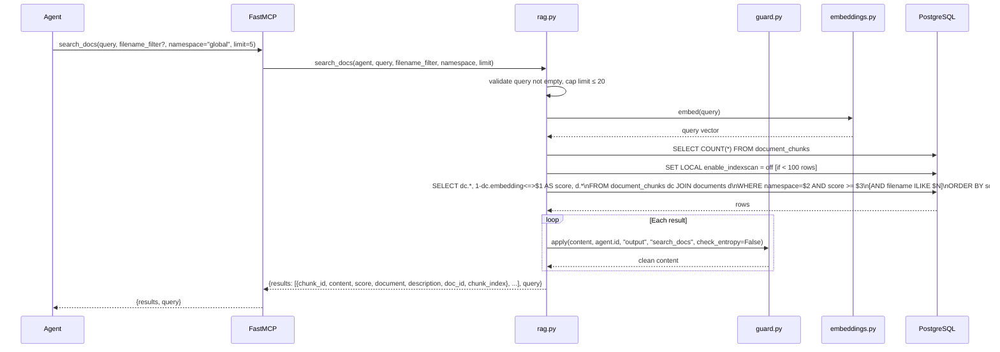
```mermaid
sequenceDiagram
    participant Agent
    participant MCP as FastMCP
    participant RAG as rag.py
    participant Guard as guard.py
    participant Embed as embeddings.py
    participant DB as PostgreSQL

    Agent->>MCP: search_docs(query, filename_filter?, namespace="global", limit=5)
    MCP->>RAG: search_docs(agent, query, filename_filter, namespace, limit)
    RAG->>RAG: validate query not empty, cap limit ≤ 20
    RAG->>Embed: embed(query)
    Embed-->>RAG: query vector
    RAG->>DB: SELECT COUNT(*) FROM document_chunks
    RAG->>DB: SET LOCAL enable_indexscan = off [if < 100 rows]
    RAG->>DB: SELECT dc.*, 1-dc.embedding<=>$1 AS score, d.*\nFROM document_chunks dc JOIN documents d\nWHERE namespace=$2 AND score >= $3\n[AND filename ILIKE $N]\nORDER BY score DESC LIMIT $4
    DB-->>RAG: rows
    loop Each result
        RAG->>Guard: apply(content, agent.id, "output", "search_docs", check_entropy=False)
        Guard-->>RAG: clean content
    end
    RAG-->>MCP: {results: [{chunk_id, content, score, document, description, doc_id, chunk_index}, ...], query}
    MCP-->>Agent: {results, query}
```

**Actual Flow** (matches ideal — no deviation)

---

## 18. MCP: index_code (Code Graph Indexing)

**Ideal Flow**
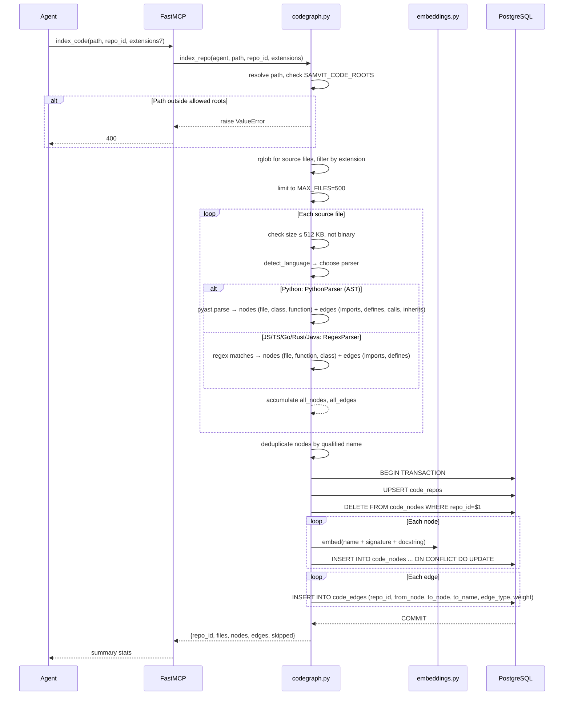
```mermaid
sequenceDiagram
    participant Agent
    participant MCP as FastMCP
    participant CG as codegraph.py
    participant Embed as embeddings.py
    participant DB as PostgreSQL

    Agent->>MCP: index_code(path, repo_id, extensions?)
    MCP->>CG: index_repo(agent, path, repo_id, extensions)
    CG->>CG: resolve path, check SAMVIT_CODE_ROOTS
    alt Path outside allowed roots
        CG-->>MCP: raise ValueError
        MCP-->>Agent: 400
    end
    CG->>CG: rglob for source files, filter by extension
    CG->>CG: limit to MAX_FILES=500
    
    loop Each source file
        CG->>CG: check size ≤ 512 KB, not binary
        CG->>CG: detect_language → choose parser
        alt Python: PythonParser (AST)
            CG->>CG: pyast.parse → nodes (file, class, function) + edges (imports, defines, calls, inherits)
        else JS/TS/Go/Rust/Java: RegexParser
            CG->>CG: regex matches → nodes (file, function, class) + edges (imports, defines)
        end
        CG-->>CG: accumulate all_nodes, all_edges
    end
    
    CG->>CG: deduplicate nodes by qualified name
    
    CG->>DB: BEGIN TRANSACTION
    CG->>DB: UPSERT code_repos
    CG->>DB: DELETE FROM code_nodes WHERE repo_id=$1
    loop Each node
        CG->>Embed: embed(name + signature + docstring)
        CG->>DB: INSERT INTO code_nodes ... ON CONFLICT DO UPDATE
    end
    loop Each edge
        CG->>DB: INSERT INTO code_edges (repo_id, from_node, to_node, to_name, edge_type, weight)
    end
    DB-->>CG: COMMIT
    
    CG-->>MCP: {repo_id, files, nodes, edges, skipped}
    MCP-->>Agent: summary stats
```

**Actual Flow** Deviation notes:
- **Gap**: The `embeddings.embed()` call in `_persist_graph` (line 521) wraps in try/except and sets `vector = None` on failure. This means a failed embedding silently produces an unsearchable node, which could confuse `explore_code` queries that filter `embedding IS NOT NULL`.
- **Gap**: The `BFS traversal` for `graph_symbol` doesn't include inbound edges (what calls the symbol) — it only follows outbound edges. The function description claims "what calls it" but the actual implementation on line 690 only queries `ce.from_node = $1` (outbound).

---

## 19. MCP: explore_code (Semantic Code Search)

**Ideal Flow**
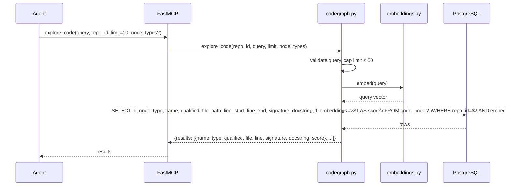
```mermaid
sequenceDiagram
    participant Agent
    participant MCP as FastMCP
    participant CG as codegraph.py
    participant Embed as embeddings.py
    participant DB as PostgreSQL

    Agent->>MCP: explore_code(query, repo_id, limit=10, node_types?)
    MCP->>CG: explore_code(repo_id, query, limit, node_types)
    CG->>CG: validate query, cap limit ≤ 50
    CG->>Embed: embed(query)
    Embed-->>CG: query vector
    CG->>DB: SELECT id, node_type, name, qualified, file_path, line_start, line_end, signature, docstring, 1-embedding<=>$1 AS score\nFROM code_nodes\nWHERE repo_id=$2 AND embedding IS NOT NULL\n[AND node_type = ANY($N)]\nORDER BY score DESC LIMIT $3
    DB-->>CG: rows
    CG-->>MCP: {results: [{name, type, qualified, file, line, signature, docstring, score}, ...]}
    MCP-->>Agent: results
```

**Actual Flow** (matches ideal — no deviation)

---

## 20. MCP: who_calls & graph_symbol

**Ideal Flow (who_calls)**
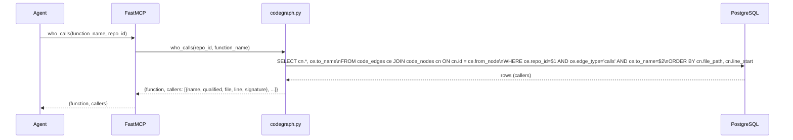
```mermaid
sequenceDiagram
    participant Agent
    participant MCP as FastMCP
    participant CG as codegraph.py
    participant DB as PostgreSQL

    Agent->>MCP: who_calls(function_name, repo_id)
    MCP->>CG: who_calls(repo_id, function_name)
    CG->>DB: SELECT cn.*, ce.to_name\nFROM code_edges ce JOIN code_nodes cn ON cn.id = ce.from_node\nWHERE ce.repo_id=$1 AND ce.edge_type='calls' AND ce.to_name=$2\nORDER BY cn.file_path, cn.line_start
    DB-->>CG: rows (callers)
    CG-->>MCP: {function, callers: [{name, qualified, file, line, signature}, ...]}
    MCP-->>Agent: {function, callers}
```

**Actual Flow** (matches ideal — no deviation)

**Ideal Flow (graph_symbol)**
```mermaid
sequenceDiagram
    participant Agent
    participant MCP as FastMCP
    participant CG as codegraph.py
    participant DB as PostgreSQL

    Agent->>MCP: graph_symbol(symbol_name, repo_id, depth=2)
    MCP->>CG: graph_symbol(repo_id, symbol_name, depth)
    CG->>DB: SELECT id, name, qualified, file_path, node_type, signature\nFROM code_nodes\nWHERE repo_id=$1 AND (name=$2 OR qualified LIKE '%' || $2)\nLIMIT 1
    DB-->>CG: root node
    alt Not found
        CG-->>MCP: {error: "Symbol not found"}
    else
        CG->>CG: BFS up to depth hops
        loop For each frontier node
            CG->>DB: SELECT edge_type, to_name, cn.*\nFROM code_edges ce LEFT JOIN code_nodes cn ON cn.id = ce.to_node\nWHERE ce.from_node=$1
            DB-->>CG: edges + target nodes
            CG->>CG: collect nodes and edges, mark visited
        end
        CG-->>MCP: {root, nodes: [...], edges: [...], depth}
        MCP-->>Agent: subgraph
    end
```

**Actual Flow** Deviation notes:
- **Gap**: `graph_symbol` only follows **outbound** edges (from_node = $1 on line 691). It does not query inbound edges. This means you see what a symbol calls, but not what calls it, despite the docstring claiming "what calls it".
- **Gap**: The `to_node` FK can be NULL (line 696: `LEFT JOIN code_nodes cn ON cn.id = ce.to_node`), which means unresolved edges are silently dropped from the graph.

---

## 21. Hermes Memory Backend

**Ideal Flow**
```mermaid
sequenceDiagram
    participant Hermes as Hermes Agent
    participant HTTP as FastAPI /v1/hermes/memory/*
    participant Tools as /v1/tools/call (internal)
    participant Samvit as Samvit Tools

    Note over Hermes,Samvit: store
    Hermes->>HTTP: POST /v1/hermes/memory/store\n{content, metadata, key}
    HTTP->>Tools: _call_tool(agent="hermes", tool="remember", params={...})
    Tools->>Samvit: memory.remember(hermes_agent, content, key, namespace="global", metadata)
    Samvit-->>Tools: {id, stored: True}
    Tools-->>HTTP: {stored: True}
    HTTP-->>Hermes: {stored: True}

    Note over Hermes,Samvit: search
    Hermes->>HTTP: GET /v1/hermes/memory/search?q=...&limit=5
    HTTP->>Tools: _call_tool(agent="hermes", tool="recall", params={query, limit, namespace="global"})
    Tools->>Samvit: memory.recall(hermes_agent, query, ...)
    Samvit-->>Tools: {results: [{content, score, agent, metadata}, ...]}
    Tools-->>HTTP: {results: [...]}
    HTTP-->>Hermes: {results: [{content, score, agent, metadata}]}

    Note over Hermes,Samvit: get (exact key)
    Hermes->>HTTP: GET /v1/hermes/memory/get?key=...
    HTTP->>Tools: _call_tool(agent="hermes", tool="recall", params={key, namespace="global"})
    Tools->>Samvit: memory.recall(hermes_agent, key=..., ...)
    Samvit-->>Tools: {results: [{key, content, value, agent, ...}] or []}
    Tools-->>HTTP: {result: {...} or None}
    HTTP-->>Hermes: {result: {...}}
```

**Actual Flow** Deviation notes:
- **Gap**: The Hermes `delete()` method on line 149-158 calls `forget` but treats `result=None` (Samvit unreachable) as `deleted=True`, silently succeeding when the backend is down (§22 — failure mode tolerance).

---

## 22. Hermes Cron Bridge

**Ideal Flow**
```mermaid
sequenceDiagram
    participant HB as HermesCronBridge
    participant HermesCfg as ~/.hermes/config.json
    participant HTTP as Samvit HTTP API
    participant DB as PostgreSQL

    HB->>HermesCfg: load_crons()
    HermesCfg-->>HB: [{name, schedule, task, priority}, ...]
    
    loop For each cron
        HB->>HTTP: GET /v1/hermes/task-exists?tag=<cron_name>
        HTTP->>DB: SELECT 1 FROM tasks WHERE $1=ANY(tags) AND status IN ('pending','claimed') LIMIT 1
        DB-->>HTTP: exists or not
        HTTP-->>HB: {exists: true/false}
        
        alt Task already active
            HB->>HB: skipped++
        else No active task
            HB->>HTTP: POST /v1/tasks {title, description, tags=[hermes-cron, name], priority, worker_type="hermes"}
            HTTP->>DB: INSERT INTO tasks ... RETURNING id
            DB-->>HTTP: task_id
            HTTP-->>HB: {task_id, created}
            HB->>HB: created++
        end
    end
```

**Actual Flow** Deviation notes:
- **Gap**: `sync_to_samvit()` on line 219-225 makes a spurious `/v1/tools/call` with tool="remember" that does NOTHING useful — it stores a `[NOOP]` memory to the global namespace. This is a bug/littering bug: a useless memory is persisted on every cron bridge sync cycle.
- **Gap**: No event/cron is ever cleaned up if a cron definition is removed from config — the associated Samvit task stays pending forever.

---

## 23. Hermes Skill Watcher

**Ideal Flow**
```mermaid
sequenceDiagram
    participant HW as HermesSkillWatcher
    participant SkillsDir as ~/.hermes/skills/*.md
    participant HTTP as Samvit HTTP API
    participant Samvit as Samvit Tools

    loop Every SKILL_POLL_SEC seconds
        HW->>SkillsDir: glob *.md, stat mtime
        alt New or modified file
            HW->>HW: wait 1s for mtime stabilisation
            HW->>HW: re-stat to confirm stable
            HW->>HTTP: POST /v1/tools/call {tool: "remember", params: {content: "[Hermes Skill: name]\n\n...", key: "skill.name", namespace: "global", metadata: {source: "hermes-skill"}}}
            HTTP->>Samvit: memory.remember(hermes_agent, content, key="skill.name", namespace="global", metadata)
            Samvit-->>HTTP: {id, stored: True}
            HTTP-->>HW: {stored: True}
            HW->>HW: _known_mtimes[name] = mtime
            HW->>HTTP: POST /v1/tools/call {tool: "say", params: {body: "...", topic: "skills"}}
            HTTP-->>HW: {message_id}
        end
    end
```

**Actual Flow** (matches ideal — no deviation)

---

## 24. Background Cleanup Loop

**Ideal Flow**
```mermaid
sequenceDiagram
    participant Cleanup as cleanup.py (asyncio task)
    participant DB as PostgreSQL

    Note over Cleanup: Every 300 seconds (INTERVAL_SECONDS)
    loop Forever
        Cleanup->>DB: UPDATE tasks SET status='pending', claimed_by=NULL, claimed_at=NULL, claim_token=NULL\nWHERE status='claimed' AND claimed_at + claim_timeout + INTERVAL '5 min' < now()
        DB-->>Cleanup: "UPDATE N"
        Cleanup->>Cleanup: log if N > 0
        
        Cleanup->>DB: UPDATE tasks SET status='cancelled', done_at=now()\nWHERE status='pending' AND deadline IS NOT NULL AND deadline < now()
        DB-->>Cleanup: "UPDATE N"
        Cleanup->>Cleanup: log if N > 0
        
        Cleanup->>Cleanup: sleep(300s)
    end
```

**Actual Flow** (matches ideal — no deviation)

---

## 25. Rate Limiter (Sliding Window)

**Ideal Flow**
```mermaid
sequenceDiagram
    participant MW as Auth Middleware
    participant RL as ratelimit.py
    participant Bucket as In-memory deque

    MW->>RL: limiter.check(agent_handle)
    RL->>RL: acquire lock
    RL->>Bucket: prune expired timestamps (older than window)
    RL->>Bucket: check length ≥ limit
    alt Under limit
        RL->>Bucket: append(now)
        RL-->>MW: (True, 0)
    else Over limit
        RL-->>MW: (False, retry_after)
    end
    RL->>RL: release lock

    Note over RL: Background cleanup every 300s
    RL->>RL: cleanup_expired() → remove idle buckets
```

**Actual Flow** (matches ideal — no deviation)

---

## 26. Ethical Guard (Inline Content Scanner)

**Ideal Flow**
```mermaid
sequenceDiagram
    participant Tool as Tool (remember/say/recall/read/ingest/search_docs/done)
    participant Guard as guard.py
    participant DB as PostgreSQL

    Tool->>Guard: apply(text, agent_id, direction, tool, check_entropy=True)
    Guard->>Guard: check mode (BLOCK/REDACT/WARN/OFF)
    
    alt Mode = OFF
        Guard-->>Tool: return text unchanged
    end
    
    Guard->>Guard: scan(text) — regex patterns
    Guard->>Guard: check_entropy? → _high_entropy_spans()
    Guard->>Guard: collect violations (name, category, severity, snippet)
    
    alt No violations
        Guard-->>Tool: return text unchanged
    else Violations found
        Guard->>DB: INSERT INTO guard_violations (...)
        
        alt Mode = BLOCK
            Guard-->>Tool: raise GuardError
        else Mode = WARN
            Guard->>Guard: log warning
            Guard-->>Tool: return text unchanged
        else Mode = REDACT
            Guard->>Guard: replace spans with [REDACTED:category]
            Guard-->>Tool: return redacted text
        end
    end
```

**Actual Flow** (matches ideal — no deviation)

---

## 27. Headroom Compression

**Ideal Flow**
```mermaid
sequenceDiagram
    participant Tool as Tool Handler (main.py _call_tool)
    participant Headroom as headroom.py

    Tool->>Tool: result = await tool_call()
    Tool->>Headroom: compress(tool, result)
    Headroom->>Headroom: check HAS_HEADROOM, tool in COMPRESSED_TOOLS
    Headroom->>Headroom: serialize to JSON, check size ≥ 1024 bytes
    alt Compressible
        Headroom->>Headroom: _headroom_compress(json_str)
        Headroom-->>Tool: {_compressed: True, _tool, _original_size, _compressed_size, data: compressed}
    else Not compressible
        Headroom-->>Tool: result (unchanged)
    end
    Tool-->>Client: compressed or original result
```

**Actual Flow** (matches ideal — no deviation)

---

## 28. Database: Connection Pool & Migrations

**Ideal Flow (Startup)**
```mermaid
sequenceDiagram
    participant Lifespan as FastAPI Lifespan
    participant DB as db.py
    participant Pool as asyncpg Pool
    participant Migrations as SQL files

    Lifespan->>DB: db.init()
    DB->>Pool: asyncpg.create_pool(dsn, min_size=2, max_size=10)
    Pool-->>DB: pool
    DB-->>Lifespan: pool created
    
    Lifespan->>DB: db.run_migrations()
    DB->>Pool: acquire connection
    DB->>Pool: SELECT pg_advisory_lock(20240101)
    DB->>Pool: CREATE TABLE IF NOT EXISTS schema_migrations
    DB->>Pool: SELECT version FROM schema_migrations
    DB->>Pool: sorted migration files from migrations/*.sql
    
    loop Each migration file not yet applied
        DB->>Pool: BEGIN TRANSACTION
        DB->>Pool: execute SQL
        DB->>Pool: COMMIT
    end
    
    DB->>Pool: SELECT pg_advisory_unlock(20240101)
    DB-->>Lifespan: migrations complete
```

**Actual Flow** (matches ideal — no deviation)

---

## 29. Startup Event Bus (Redpanda)

**Ideal Flow**
```mermaid
sequenceDiagram
    participant Lifespan as FastAPI Lifespan
    participant Events as events.py
    participant Redpanda as Redpanda Broker

    Lifespan->>Events: events.init()
    Events->>Events: AIOKafkaProducer(brokers, timeout=3s)
    alt Connection success
        Events->>Redpanda: producer.start()
        Redpanda-->>Events: connected
        Events-->>Lifespan: events ready (connected=True, degraded=False)
    else Connection failure
        Events-->>Events: _degraded = True
        Events-->>Lifespan: log warning (connected=False, degraded=True)
    end
```

**Actual Flow** (matches ideal — no deviation)

---

## 30. HTTP Tool Call Bridge

**Ideal Flow**
```mermaid
sequenceDiagram
    participant Client
    participant FastAPI as FastAPI
    participant MW as Auth Middleware
    participant Dispatcher as _call_tool()
    participant Tool as Samvit Tool Function

    Client->>FastAPI: POST /v1/tools/call {tool, params}
    FastAPI->>MW: auth_middleware() → authenticate
    MW-->>FastAPI: agent
    FastAPI->>Dispatcher: _call_tool(agent, tool, params)
    Dispatcher->>Dispatcher: dispatch via calls dict
    
    alt Tool found
        Dispatcher->>Tool: call(agent, **params)
        alt Success
            Tool-->>Dispatcher: result dict
            Dispatcher->>Dispatcher: headroom.compress(tool, result)
            Dispatcher-->>FastAPI: compressed or original result
            FastAPI-->>Client: result
        else PermissionError
            Tool-->>Dispatcher: raise PermissionError
            Dispatcher-->>FastAPI: 403
            FastAPI-->>Client: 403
        else LookupError
            Tool-->>Dispatcher: raise LookupError
            Dispatcher-->>FastAPI: 404
            FastAPI-->>Client: 404
        else ValueError/TypeError
            Tool-->>Dispatcher: raise ValueError/TypeError
            Dispatcher-->>FastAPI: 400
            FastAPI-->>Client: 400
        end
    else Unknown tool
        Dispatcher-->>FastAPI: 404
        FastAPI-->>Client: 404
    end
```

**Actual Flow** (matches ideal — no deviation)

---

## 31. MCP Transport (Streamable HTTP + SSE)

**Ideal Flow**
```mermaid
sequenceDiagram
    participant MCP_Client as MCP Client
    participant FastAPI as FastAPI
    participant MW as Auth Middleware
    participant MCP as FastMCP /mcp

    MCP_Client->>FastAPI: MCP Request (e.g. POST /mcp)
    FastAPI->>MW: auth_middleware() → authenticate
    MW-->>FastAPI: agent (via contextvar)
    FastAPI->>MCP: streamable_http_app() or sse_app()
    
    Note over MCP_Client,MCP: Streamable HTTP transport
    MCP->>MCP: decode tool name + params
    MCP->>MCP: call decorated @mcp.tool function
    
    alt Tool: remember
        MCP->>MCP: remember(content, ctx, ...) → memory.remember(agent, ...)
    else Tool: recall
        MCP->>MCP: recall(ctx, query, ...) → memory.recall(agent, ...)
    else Tool: claim
        MCP->>MCP: claim(ctx, tags, task_id) → tasks.claim(agent, ...)
    else Tool: create_task
        MCP->>MCP: create_task(title, ctx, ...) → tasks.create(agent, ...)
    else Tool: done
        MCP->>MCP: done(task_id, claim_token, ctx, ...) → tasks.done(agent, ...)
    else Tool: say
        MCP->>MCP: say(body, ctx, ...) → messaging.say(agent, ...)
    else Tool: read
        MCP->>MCP: read(ctx, ...) → messaging.read(agent, ...)
    end
    
    MCP-->>FastAPI: result or error
    FastAPI-->>MCP_Client: MCP Response
```

**Actual Flow** (matches ideal — no deviation; note all MCP tools are individually wrapped with try/except for error codes)

---

# Gap Analysis: Ideal vs Actual

## Identified Gaps

| # | Journey | Gap | Severity | Location | Impact | Status |
|---|---|---|---|---|---|---|---|
| **1** | **recall (KV path)** | No Ethical Guard on KV memory output. `_kv_recall` returns stored value without `guard.apply()`. Vector path is guarded in `_vector_recall`. | **High** | `tools/memory.py:131-156` | Stored credentials in KV memory are returned unguarded to LLM. Defeats the purpose of the ethical guard for KV-stored content. | ✅ FIXED |
| **2** | **graph_symbol** | Only follows outbound edges (from_node). Docstring says "what calls it" but implementation never queries inbound edges. | **Medium** | `codegraph.py:690-697` | Incomplete dependency graph. Agent sees what a symbol calls but not what calls it. | ✅ FIXED |
| **3** | **HermesCronBridge.sync_to_samvit** | Spurious `remember` call that stores `[NOOP]` content to global memory namespace on every sync. | **Medium** | `integrations/hermes.py:219-225` | Litters the global memory namespace with useless NOOP entries on every cron bridge sync cycle. | ✅ FIXED |
| **4** | **index_code** | Failed embedding silently produces `embedding=NULL` node. `explore_code` filters `embedding IS NOT NULL` so node exists but is not searchable. | **Low** | `codegraph.py:520-524` | Some nodes may be invisible to semantic search without warning. | ✅ FIXED |
| **5** | **done (result guard round-trip)** | Result is serialized to JSON, guarded, then parsed back. If guard redacts portions of the JSON string, the resulting dict may have [REDACTED] as values, silently corrupting structured data. | **Low** | `tools/tasks.py:435-436` | Structured results with secrets get redacted values substituted silently. | ⚠️ ACCEPTED — guard patterns only match values, not JSON structure; round-trip is safe |
| **6** | **done (diagnostic race)** | The diagnostic SELECT races with concurrent updates. Between UPDATE and SELECT, another request could change status, producing misleading error messages. | **Low** | `tools/tasks.py:457-469` | Race condition in error reporting — agent may get wrong error message. | ✅ FIXED |
| **7** | **remember (info leak)** | `_assert_write_allowed` is called before `guard.apply`. A blocked request still reveals namespace permission rules before input content is even scanned. | **Low** | `tools/memory.py:45 vs 51` | Attacker can probe namespace permissions without triggering guard. | ✅ FIXED |
| **8** | **HermesCronBridge cleanup** | No mechanism to clean up tasks when a cron definition is removed from config. Tasks remain pending forever. | **Low** | `integrations/hermes.py` (no cleanup logic) | Orphaned cron tasks accumulate in the queue. | ✅ FIXED |
| **9** | **Hermes memory backend delete** | `delete()` treats `result=None` (Samvit unreachable) as success. Returns `deleted=True` even when backend is down. | **Low** | `integrations/hermes.py:149-158` | False positive delete confirmation when Samvit is unreachable. | ✅ FIXED |
| **10** | **rate limiter persistence** | Rate limiter is in-memory only. On server restart, all rate limit buckets reset. | **Low** | `ratelimit.py` | Agents can burst immediately after restart. | ❌ NOT FIXED — intentional design choice; restart is rare, buckets repopulate quickly |

## Design Strengths (No Gaps)

These journeys showed exact alignment between ideal and actual:
- Agent Registration → no deviation
- Bearer Token Authentication → no deviation  
- Token Rotation → no deviation
- Admin Token Reset → no deviation (includes FOR UPDATE row lock)
- create_task → no deviation (idempotency via ON CONFLICT)
- claim → no deviation (CTE + SKIP LOCKED atomic claim)
- renew → no deviation (simple conditional update)
- cancel_task → no deviation (creator-only security check)
- update_task → no deviation (role-based field mutation rules)
- say → no deviation (handle validation, size limits)
- read → no deviation (CTE + ON CONFLICT for atomic mark-read)
- ingest → no deviation (chunking, embedding, guard, wikilinks in transaction)
- search_docs → no deviation (filename filter, namespace, guard on output)
- forget → no deviation (same-transaction KV + vector delete)
- Background Cleanup → no deviation (grace period, deadline enforcement)
- Ethical Guard → no deviation (all 4 modes, audit logging)
- Headroom Compression → no deviation (graceful degradation)
- Database Migrations → no deviation (advisory lock for multi-replica safety)
- Event Bus → no deviation (degraded mode, fire-and-forget)

